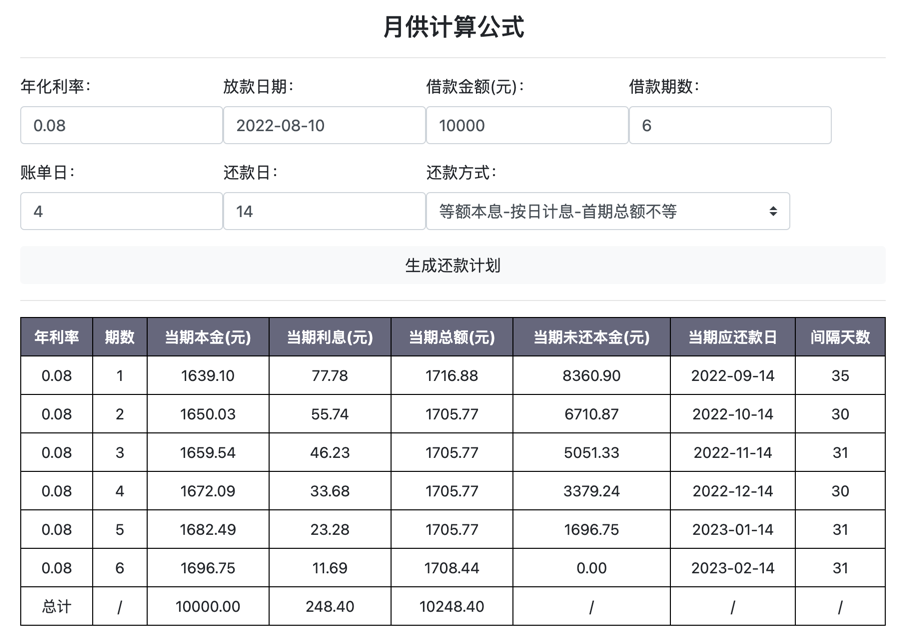

##### 基础配置信息（精度 + 利率）
```json
{
  "precisionInfoRule": {
    "dayRatePrecisionRule": "@precision.init(12,'HALF_UP')",
    "monthRatePrecisionRule": "@precision.init(12,'HALF_UP')",
    "processPrecisionRule": "@precision.init(8,'HALF_UP')",
    "resultPrecisionRule": "@precision.init(2,'HALF_UP')"
  },
  "rateInfoRule": {
    "dayOfMulctRateRule": "#MYR.divide(360,#DRP)",
    "dayOfYearRateRule": "#YR.divide(360,#DRP)",
    "monthOfMulctRateRule": "#MYR.divide(12,#MRP)",
    "monthOfYearRateRule": "#YR.divide(12,#MRP)",
    "mulctRateRule": "#YR.multiply(1.5)",
    "yearRateRule": "0.072"
  }
}
```

##### 还款计划配置信息 （等额本息）
```json
{
    "firstInterestRule":{
        "firstInterestAmountRule":"#LA.multiply(#DAYS_FUNCTION(#FSD,#FRD).multiply(#DR),#RP)",
        "firstPrincipalAmountRule":"#MA.subtract(#LA.multiply(#MR),#RP)",
        "firstRepayDateRule":"#FRD_FUNCTION(#RDN,#BDN,#PD)",
        "firstStartDateRule":"#PD",
        "firstTotalAmountRule":"#FPA.add(#FIA)",
        "monthAmountRule":"#LA.multiply(#MR).multiply(#MR.add(1).pow(#LM)).divide(#MR.add(1).pow(#LM).subtract(1),#RP)",
        "notPrincipalAmountRule":"#LA.subtract(#FPA)"
    },
    "middleInterestRule":{
        "middleInterestAmountRule":"#NPA.multiply(#MR,#RP)",
        "middlePrincipalAmountRule":"#MA.subtract(#NPA.multiply(#MR),#RP)",
        "middleRepayDateRule":"#MONTH_ADD_FUNCTION(#FRD,#CLM.subtract(1))",
        "middleTotalAmountRule":"#MA",
        "monthAmountRule":"#MA",
        "notPrincipalAmountRule":"#NPA.subtract(#MPA)"
    },
    "lastInterestRule":{
        "lastInterestAmountRule":"#NPA.multiply(#MR,#RP)",
        "lastPrincipalAmountRule":"#NPA",
        "lastRepayDateRule":"#MONTH_ADD_FUNCTION(#FRD,#LM.subtract(1))",
        "lastTotalAmountRule":"#LPA.add(#LIA)",
        "monthAmountRule":"#MA",
        "notPrincipalAmountRule":"#NPA.subtract(#LPA)"
    }
}
```

##### 还款计划配置信息 （等额本金）
```json
{
    "firstInterestRule":{
        "firstInterestAmountRule":"#LA.multiply(#DAYS_FUNCTION(#FSD,#FRD).multiply(#DR),#RP)",
        "firstPrincipalAmountRule":"#MA",
        "firstRepayDateRule":"#FRD_FUNCTION(#RDN,#BDN,#PD)",
        "firstStartDateRule":"#PD",
        "firstTotalAmountRule":"#FPA.add(#FIA)",
        "monthAmountRule":"#LA.divide(#LM,#RP)",
        "notPrincipalAmountRule":"#LA.subtract(#FPA)"
    },
    "middleInterestRule":{
        "middleInterestAmountRule":"#NPA.multiply(#MR,#RP)",
        "middlePrincipalAmountRule":"#MA",
        "middleRepayDateRule":"#MONTH_ADD_FUNCTION(#FRD,#CLM.subtract(1))",
        "middleTotalAmountRule":"#MPA.add(#MIA)",
        "monthAmountRule":"#MA",
        "notPrincipalAmountRule":"#NPA.subtract(#MPA)"
    },
    "lastInterestRule":{
        "lastInterestAmountRule":"#NPA.multiply(#MR,#RP)",
        "lastPrincipalAmountRule":"#NPA",
        "lastRepayDateRule":"#MONTH_ADD_FUNCTION(#FRD,#LM.subtract(1))",
        "lastTotalAmountRule":"#LPA.add(#LIA)",
        "monthAmountRule":"#MA",
        "notPrincipalAmountRule":"#NPA.subtract(#LPA)"
    }
}
```

##### 实际还款配置信息
```json
{
  "allCompensateRule": {
    "basePayoffRule": {
      "onRepayDatePayoffRule": {
        "nextRealRepayDateRule": "#DAY_ADD_FUNCTION(#NOW,1)",
        "nextRealRepayInterestAmountRule": "#NENA.multiply(#DR).multiply(#DAYS_FUNCTION(#ESD,#NOW).add(1),#RP)",
        "nextRealRepayPrincipalAmountRule": "NEPA",
        "nextRealRepayTypeRule": "#ART",
        "nextRealSettleDateRule": "#DAY_ADD_FUNCTION(#NOW,1)",
        "realRepayPrincipalAmountRule": "#EPA"
      },
      "payoffRule": {
        "nextRealRepayPrincipalAmountRule": "#NEPA",
        "realRepayDateRule": "#DAY_ADD_FUNCTION(#NOW,1)",
        "realRepayInterestAmountRule": "#EIA",
        "realRepayPrincipalAmountRule": "#EPA",
        "realRepayTypeRule": "#NRT",
        "realSettleDateRule": "#DAY_ADD_FUNCTION(#NOW,1)"
      }
    },
    "singleCompensateRule": {
      "overdueRule": {
        "realRepayDateRule": "#DAY_ADD_FUNCTION(#NOW,1)",
        "realRepayInterestAmountRule": "#EIA",
        "realRepayMulctAmountRule": "#DAYS_FUNCTION(#ERD,#NOW).add(1) > 3 ? #EPA.multiply(#MDR).multiply(#DAYS_FUNCTION(#ERD,#NOW).add(1),#RR).min(#EPA) : 0",
        "realRepayPrincipalAmountRule": "#EPA",
        "realRepayTypeRule": "#DAYS_FUNCTION(#ERD,#NOW).add(1) > 3 ? #ORT : #NRT",
        "realSettleDateRule": "#DAY_ADD_FUNCTION(#NOW,1)"
      }
    }
  },
  "basePayoffRule": {
    "onRepayDatePayoffRule": {
      "nextRealRepayDateRule": "#DAY_ADD_FUNCTION(#NOW,1)",
      "nextRealRepayInterestAmountRule": "#NENA.multiply(#DR).multiply(#DAYS_FUNCTION(#ESD,#NOW).add(1),#RP)",
      "nextRealRepayPrincipalAmountRule": "NEPA",
      "nextRealRepayTypeRule": "#ART",
      "nextRealSettleDateRule": "#DAY_ADD_FUNCTION(#NOW,1)",
      "realRepayPrincipalAmountRule": "#EPA"
    },
    "payoffRule": {
      "nextRealRepayPrincipalAmountRule": "#NEPA",
      "realRepayDateRule": "#DAY_ADD_FUNCTION(#NOW,1)",
      "realRepayInterestAmountRule": "#EIA",
      "realRepayPrincipalAmountRule": "#EPA",
      "realRepayTypeRule": "#NRT",
      "realSettleDateRule": "#DAY_ADD_FUNCTION(#NOW,1)"
    }
  },
  "normalRule": {
    "realRepayDateRule": "#DAY_ADD_FUNCTION(#ERD,1)",
    "realRepayInterestAmountRule": "#EIA",
    "realRepayPrincipalAmountRule": "#EPA",
    "realRepayTypeRule": "#NRT",
    "realSettleDateRule": "#ERD"
  },
  "overdueRule": {
    "realRepayDateRule": "#DAY_ADD_FUNCTION(#NOW,1)",
    "realRepayInterestAmountRule": "#EIA",
    "realRepayMulctAmountRule": "#DAYS_FUNCTION(#ERD,#NOW).add(1) > 3 ? #EPA.multiply(#MDR).multiply(#DAYS_FUNCTION(#ERD,#NOW).add(1),#RR).min(#EPA) : 0",
    "realRepayPrincipalAmountRule": "EPA",
    "realRepayTypeRule": "#DAYS_FUNCTION(#ERD,#NOW).add(1) > 3 ? #ORT : #NRT",
    "realSettleDateRule": "#DAY_ADD_FUNCTION(#NOW,1)"
  },
  "singleCompensateRule": {
    "overdueRule": {
      "realRepayDateRule": "#DAY_ADD_FUNCTION(#NOW,1)",
      "realRepayInterestAmountRule": "#EIA",
      "realRepayMulctAmountRule": "#DAYS_FUNCTION(#ERD,#NOW).add(1) > 3 ? #EPA.multiply(#MDR).multiply(#DAYS_FUNCTION(#ERD,#NOW).add(1),#RR).min(#EPA) : 0",
      "realRepayPrincipalAmountRule": "#EPA",
      "realRepayTypeRule": "#DAYS_FUNCTION(#ERD,#NOW).add(1) > 3 ? #ORT : #NRT",
      "realSettleDateRule": "#DAY_ADD_FUNCTION(#NOW,1)"
    }
  }
}
```